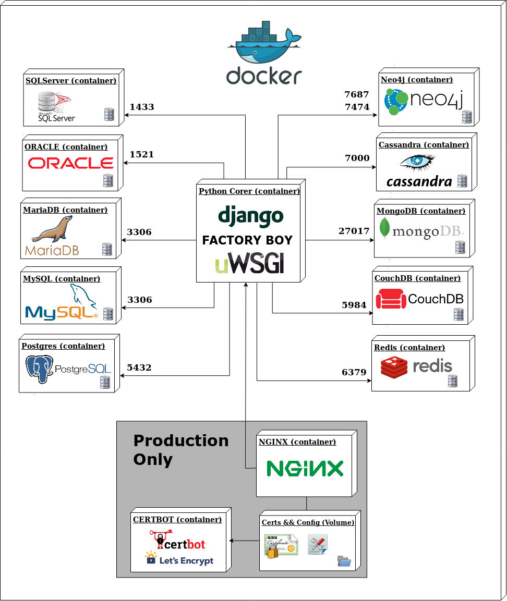

# Bsolutions
---



## Docker

#### Prerequisitos

Download && install **docker**
- [For Mac](https://download.docker.com/mac/stable/Docker.dmg)
- [For Windows](https://download.docker.com/win/stable/InstallDocker.msi)
- [For Linux](https://docs.docker.com/engine/getstarted/step_one/#docker-for-linux)

Download && install **docker-compose**
- [Instructions](https://docs.docker.com/compose/install/)

Download && install **docker-machine**
- [Instructions](https://docs.docker.com/machine/install-machine/)


#### Happy path for `local` environment

Just run:
```
cd docker/local
bash docker.sh up
```

The docker configuration is explained in detail below.

#### Script bash and env vars

In `docker/local` there is a bash script in the` docker.sh` file that can be run like this:
```
./docker.sh parameters
# Or
bash docker.sh parameters  // If you have a different bash shell like oh my zsh
```

There are serveral files with environment variables or config files to consider:

- `docker/local/.env` # Environment variables needed to run the bash script
- `docker/local/django/.env` # Django service environment variables
- `docker/local/pgadmin/.env` # Pgadmin service environment variables
- `docker/local/postgres/.env` # Postgres service environment variables

Files with environment variables `.env` and other config files mentioned below are ignored and will be created automatically from the `*.example` files.

#### Commands

**Notes:**

- Params between {} are optional, except {}*.
- Service names available: `Service names: django | postgres | redis | nginx | certbot | celeryworker | celerybeat | flower | pgadmin`

The following describes each of the parameters::

**Usage: docker.sh [up|start|restart|stop|rm|sh|bash|logs|ps]**

* `build` --> Build services.
* `push` --> Tagging images and upload it to docker registry services.
* `deploy` --> Build and run services.
* `server.up {secure}` --> Build and run server (nginx) services; "secure" parameter is optional for ssl configuration
* `up {secure}` --> Build && deploy services; "secure" parameter is optional for ssl configuration.
* `start {service}` --> Start services.
* `restart {service}` --> Restart services.
* `stop {service}` --> Stop services.
* `rm {service}` --> Remove services.
* `sh {service}*` --> Connect to "service" shell.
* `bash {service}*` --> Connect to "service" bash shell
* `logs {service}* {n_last_lines}` --> Show "service" server logs


# Project scripts

docker-compose -f local.yml run django python3 manage.py populate_database --iteraciones {N}

* To create an **superuser account**, use this command::
```
$ python manage.py createsuperuser
```
